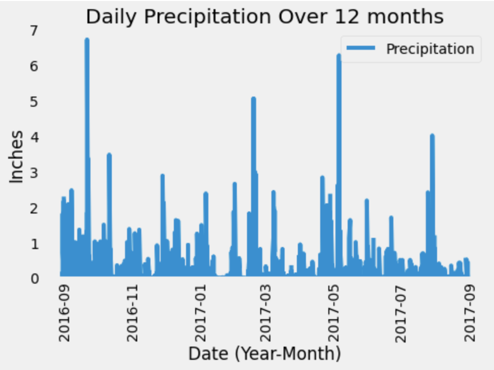
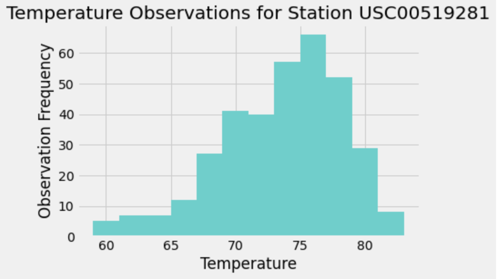

# sqlalchemy-challenge

## Background
Use Python and SQLAlchemy to do basic climate analysis and data exploration of a Hawaii climate database. Once analysis is complete, design a Flask API based on SQLAlchemy ORM queries. 

## Technologies Used
- Python
- SQLAlchemy
- Pandas
- Matplotlib

## Objectives

1. Data analysis and exploration
2. Flask API design

## Data Analysis and Exploration

First, set up base, create classes for each table, and connect to the sqlite database.

```python
# set up Base
Base = declarative_base()

# create classes for tables within database
class Measurement(Base):
    __tablename__ = "measurement"
    
    id = Column(Integer, primary_key=True)
    station = Column(String)
    date = Column(Date)
    prcp = Column(Float)
    tobs = Column(Float)

class Station(Base):
    __tablename__ = "station"
    
    id = Column(Integer, primary_key=True)
    station = Column(String)
    name = Column(String)
    latitude = Column(Float)
    longitude = Column(Float)
    elevation =  Column(Float)

# connect to database
engine = create_engine("sqlite:///Resources/hawaii.sqlite")
conn = engine.connect()
session = Session(bind=engine)
```

Climate Analyis: Obtain the last 12 months of precipitation data, convert into a dataframe, and plot a bar chart.

```python
# query last 12 months of prcp data
recent_prcp = session.query(Measurement.date, Measurement.prcp)\
    .filter(Measurement.date > '2016-08-22')\
    .filter(Measurement.date <= '2017-08-23')\
    .order_by(Measurement.date).all()

# load query results into a Pandas dataframe
prcp_df = pd.DataFrame(recent_prcp, columns = ["Date", "Precipitation"])

# set index to the date column
prcp_df.set_index("Date", inplace=True)

# plot precipitation results using Dataframe plot method
prcp_plot = prcp_df.plot(figsize=(7,5), ylim=(0,7), title = "Daily Precipitation Over 12 months", rot=90)
prcp_plot.set_ylabel("Inches")
prcp_plot.set_xlabel("Date (Year-Month)")
prcp_plot.grid()
plt.savefig("Images/precipitation_bar.png")
plt.show()
```


Station Analysis: Calculate total number of stations, find the most active stations by highest number of observations, obtain the last 12 months of temperature data for the most active station, convert to a dataframe and plot a histogram.

```Python
#calculate the total number of stations
total_stations = session.query(func.count(func.distinct(Measurement.station))).first()[0]

#find the most active stations
active_stations = session.query(Measurement.station, func.count(Measurement.id))\
    .group_by(Measurement.station)\
    .order_by(func.count(Measurement.id).desc()).all()

# get the last 12 months of temperature observation data for station USC00519281
tobs_station = session.query(Measurement.station, Measurement.tobs)\
    .filter(Measurement.date > '2016-08-23')\
    .filter(Measurement.date <= '2017-08-23')\
    .filter(Measurement.station == "USC00519281").all()

# convert results to a dataframe for plotting
station_temp_df = pd.DataFrame(tobs_station, columns=["Station", "Temp. Observations"])

# plot a histogram of the results
station_temp_df["Temp. Observations"].hist(bins=12, color="mediumturquoise")
plt.title("Temperature Observations for Station USC00519281")
plt.xlabel("Temperature")
plt.ylabel("Observation Frequency")
plt.savefig("Images/histogram_tobs.png")
plt.show()
```

## Flask API Design


## Bonus