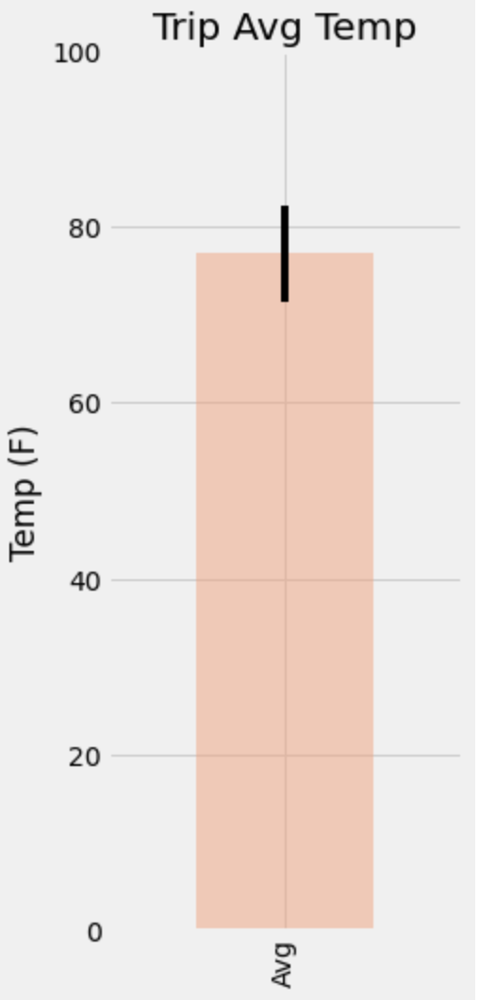
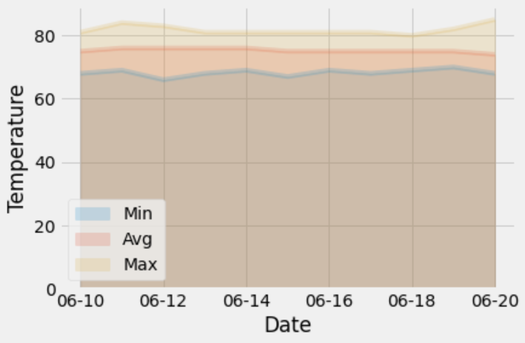

# sqlalchemy-challenge

## Background
Use Python and SQLAlchemy to do basic climate analysis and data exploration of a Hawaii climate database that contains precipitation and temperature observations across 9 stations. Once analysis is complete, design a Flask API based on SQLAlchemy ORM queries. 

## Technologies Used
- Python
- SQLAlchemy
- Pandas
- Matplotlib

## Objectives

1. Data analysis and exploration
2. Flask API design

## Data Analysis and Exploration

First, set up base, create classes for each table, and connect to the sqlite database.

```python
# set up Base
Base = declarative_base()

# create classes for tables within database
class Measurement(Base):
    __tablename__ = "measurement"
    
    id = Column(Integer, primary_key=True)
    station = Column(String)
    date = Column(Date)
    prcp = Column(Float)
    tobs = Column(Float)

class Station(Base):
    __tablename__ = "station"
    
    id = Column(Integer, primary_key=True)
    station = Column(String)
    name = Column(String)
    latitude = Column(Float)
    longitude = Column(Float)
    elevation =  Column(Float)

# connect to database
engine = create_engine("sqlite:///Resources/hawaii.sqlite")
conn = engine.connect()
session = Session(bind=engine)
```

Climate Analyis: Obtain the last 12 months of precipitation data, convert into a dataframe, and plot a bar chart.

```python
# query last 12 months of prcp data
recent_prcp = session.query(Measurement.date, Measurement.prcp)\
    .filter(Measurement.date > '2016-08-22')\
    .filter(Measurement.date <= '2017-08-23')\
    .order_by(Measurement.date).all()

# load query results into a Pandas dataframe
prcp_df = pd.DataFrame(recent_prcp, columns = ["Date", "Precipitation"])

# set index to the date column
prcp_df.set_index("Date", inplace=True)

# plot precipitation results using Dataframe plot method
prcp_plot = prcp_df.plot(figsize=(7,5), ylim=(0,7), title = "Daily Precipitation Over 12 months", rot=90)
prcp_plot.set_ylabel("Inches")
prcp_plot.set_xlabel("Date (Year-Month)")
prcp_plot.grid()
plt.savefig("Images/precipitation_bar.png")
plt.show()
```


Station Analysis: Calculate total number of stations, find the most active stations by highest number of observations, obtain the last 12 months of temperature data for the most active station, convert to a dataframe and plot a histogram.

```Python
#calculate the total number of stations
total_stations = session.query(func.count(func.distinct(Measurement.station))).first()[0]

#find the most active stations
active_stations = session.query(Measurement.station, func.count(Measurement.id))\
    .group_by(Measurement.station)\
    .order_by(func.count(Measurement.id).desc()).all()

# get the last 12 months of temperature observation data for station USC00519281
tobs_station = session.query(Measurement.station, Measurement.tobs)\
    .filter(Measurement.date > '2016-08-23')\
    .filter(Measurement.date <= '2017-08-23')\
    .filter(Measurement.station == "USC00519281").all()

# convert results to a dataframe for plotting
station_temp_df = pd.DataFrame(tobs_station, columns=["Station", "Temp. Observations"])

# plot a histogram of the results
station_temp_df["Temp. Observations"].hist(bins=12, color="mediumturquoise")
plt.title("Temperature Observations for Station USC00519281")
plt.xlabel("Temperature")
plt.ylabel("Observation Frequency")
plt.savefig("Images/histogram_tobs.png")
plt.show()
```


## Flask API Design
Design a Flask API based on the queries that were developed during the climate analysis. 

NOTE: dependencies and set-up were identical to the climate analysis overview except for the engine and session creation. 

```python
# create engine and session to link to the database
engine = create_engine("sqlite:///Resources/hawaii.sqlite")
conn = engine.connect()
session = scoped_session(sessionmaker(bind=engine))

# establish app
app = Flask(__name__)
```
### Home Page Route
```python
@app.route("/")
def main():
    return (
        f"Welcome to the Climate App Home Page!<br>"
        f"Available Routes Below:<br>"
        f"Precipitation measurement over the last 12 months: /api/v1.0/precipitation<br>"
        f"A list of stations and their respective station numbers: /api/v1.0/stations<br>"
        f"Temperature observations at the most active station over the previous 12 months: /api/v1.0/tobs<br>"
        f"Enter a start date to retrieve the minimum, maximum, and average temperatures after the specified date: /api/v1.0/<start><br>"
        f"Enter both a start and end date to retrieve the minimum, maximum, and average temperatures between those dates: /api/v1.0/<start>/<end><br>"
    )
```
### Precipitation Route
```python
@app.route("/api/v1.0/precipitation")
def precip():

    recent_prcp = session.query(str(Measurement.date), Measurement.prcp)\
    .filter(Measurement.date > '2016-08-22')\
    .filter(Measurement.date <= '2017-08-23')\
    .order_by(Measurement.date).all()

    # convert results to a dictionary with date as key and prcp as value
    prcp_dict = dict(recent_prcp)

    # return json list of dictionary
    return jsonify(prcp_dict)
```
### Stations Route
```python
@app.route("/api/v1.0/stations")
def stations():

    stations = session.query(Station.name, Station.station).all()

    # convert results to a dict
    stations_dict = dict(stations)

    # return json list of dict
    return jsonify(stations_dict)
```
### Temperture Observations (tobs) Route
```python
@app.route("/api/v1.0/tobs")
def tobs():

    tobs_station = session.query(str(Measurement.date), Measurement.tobs)\
    .filter(Measurement.date > '2016-08-23')\
    .filter(Measurement.date <= '2017-08-23')\
    .filter(Measurement.station == "USC00519281")\
    .order_by(Measurement.date).all()

    # convert results to dict
    tobs_dict = dict(tobs_station)

    # return json list of dict
    return jsonify(tobs_dict)
```
### Start - End for Given Dates Route
```python
@app.route("/api/v1.0/<start>")
@app.route("/api/v1.0/<start>/<end>")
def start_date(start, end=None):

    q = session.query(str(func.min(Measurement.tobs)), str(func.max(Measurement.tobs)), str(func.round(func.avg(Measurement.tobs))))

    if start:
        q = q.filter(Measurement.date >= start)

    if end:
        q = q.filter(Measurement.date <= end)

    # convert results into a dictionary

    results = q.all()[0]

    keys = ["Min Temp", "Max Temp", "Avg Temp"]

    temp_dict = {keys[i]: results[i] for i in range(len(keys))}

    return jsonify(temp_dict)
```

## Bonus
### Temperature Analysis I: 
Is there a meaningul difference between temperatures between the months of June and December? 

```python
# get all temperatures during June at all stations in all years
june_temps = session.query(Measurement.date, Measurement.tobs)\
    .filter(extract("month", Measurement.date) == "6").all()

# convert to dataframe
june_temps = pd.DataFrame(june_temps, columns = ["Date", "Temperature"])

# get the average temperature in December at all stations in all years
dec_temps = session.query(Measurement.date, Measurement.tobs)\
    .filter(extract("month", Measurement.date) == "12").all()

# convert to dataframe
dec_temps = pd.DataFrame(dec_temps, columns = ["Date", "Temperature"])

# create temp variables from each dataframe
june = june_temps["Temperature"]
dec = dec_temps["Temperature"]

# use the t-test to determine whether the difference in the means, if any, is statistically significant
results = ttest_ind(june, dec)
```
#### T-test:
Above, a paired t-test was used to calculate the means of two different independent samples: temperature for June vs temperature for December across all available years in the dataset.

Results: t = 31.60, p = 3.90

Concluion: With the p-value exceeding the 0.05 level of significance, there is not sufficient evidence to conclude that there is a significant difference in means between June and December temperatures across all years available.

### Temperature Analysis II: 
Choose a date range for a trip and use the calc_temps function to calculate the min, avg, and max temperatures for the trip using the matching dates from the previous year. Plot the min, avg, and max temperature from the query as a bar chart.

```python
# This function will accept start date and end date in the format '%Y-%m-%d' 
# and return minimum, average, and maximum temperatures for a date range
def calc_temps(start_date, end_date):
    """TMIN, TAVG, and TMAX for a list of dates.
    
    Args:
        start_date (string): A date string in the format %Y-%m-%d
        end_date (string): A date string in the format %Y-%m-%d
        
    Returns:
        TMIN, TAVE, and TMAX
    """
    
    return session.query(func.min(Measurement.tobs), func.round(func.avg(Measurement.tobs)), func.max(Measurement.tobs))\
        .filter(Measurement.date >= start_date).filter(Measurement.date <= end_date).all()[0]

# convert to a list
trip_temps = calc_temps("2017-06-10", "2017-06-20")

# pass to dataframe for plotting
keys = ["Min", "Avg", "Max"]

dict_temps = {keys[i]: trip_temps[i] for i in range(len(trip_temps))}

temp_df = pd.DataFrame.from_dict(dict_temps, orient="index", columns=["Temp"])

# calculate standard deviation to plot yerr
min_max = [72, 83]
temp_std = np.std(min_max)
error = temp_std

# plot bar chart
temp_df[1:2].plot(kind="bar", figsize=(3,8), ylim=(0,100), color="lightsalmon", alpha=0.5, legend=False, yerr=error)
plt.title("Trip Avg Temp")
plt.ylabel("Temp (F)")
plt.savefig("Images/avg_temp_bonus.png")
plt.show()
```


### Daily Rainfall Average:
Calculate the rainfall per weather station using the years previous matching dates for the trip. 
```python
# calculate the rainfall per weather station using previous year's matching dates
prcp_2016 = session.query(Measurement.station, func.round(func.sum(Measurement.prcp), 2))\
    .filter(Measurement.date > '2016-06-10')\
    .filter(Measurement.date <= '2016-06-20')\
    .order_by(Measurement.date).group_by(Measurement.station).all()
```
### Daily Temperature Normals (Min, Max, and Avg Temperatures):
Calculate the daily minimum, maximum, and average temperatures for the trip and plot an area plot with the results. 
```python
# define daily normals function
def daily_normals(date):
    """Daily Normals.
    
    Args:
        date (str): A date string in the format '%m-%d'
        
    Returns:
        A list of tuples containing the daily normals, tmin, tavg, and tmax
    
    """
    
    return session.query(func.min(Measurement.tobs), func.round(func.avg(Measurement.tobs)), func.max(Measurement.tobs))\
    .filter(func.strftime("%m-%d", Measurement.date) == date).all()[0]

# create a list of dates for the trip
trip_dates = ["06-10", "06-11", "06-12", "06-13", "06-14", "06-15", "06-16", "06-17", "06-18", "06-19", "06-20"]

# use daily normals function to calculate temp for each date in trip_dates and append to list
trip_results = []

for i, date in enumerate(trip_dates):
    
    trip_temps = daily_normals(date)
    
    trip_results.append(trip_temps)

# create dict of dates and tobs for trip dates
trip_temps_dict = {trip_dates[i]: trip_results[i] for i in range(len(trip_results))}

# convert dict to dataframe
trip_df = pd.DataFrame.from_dict(trip_temps_dict, orient="index", columns=["Min", "Avg", "Max"])

# create an area plot
trip_df.plot.area(stacked=False, alpha=0.2)
plt.ylabel("Temperature")
plt.xlabel("Date")
plt.savefig("Images/area_plot.png")
plt.show()
```

